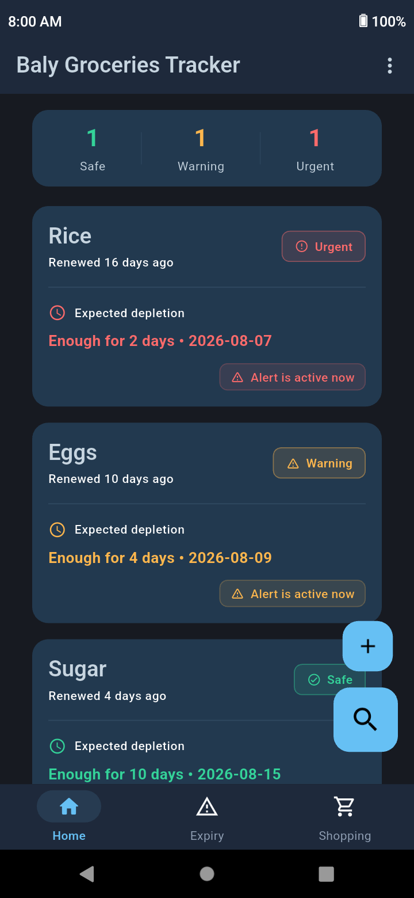
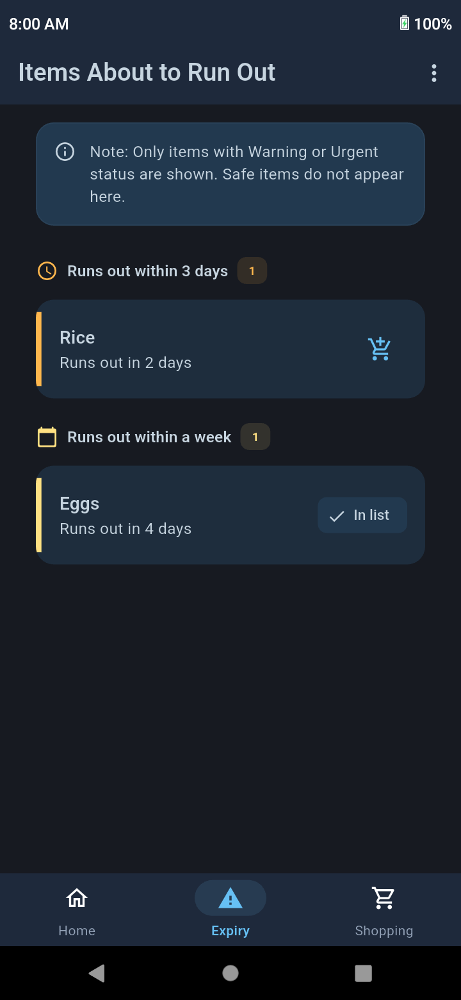
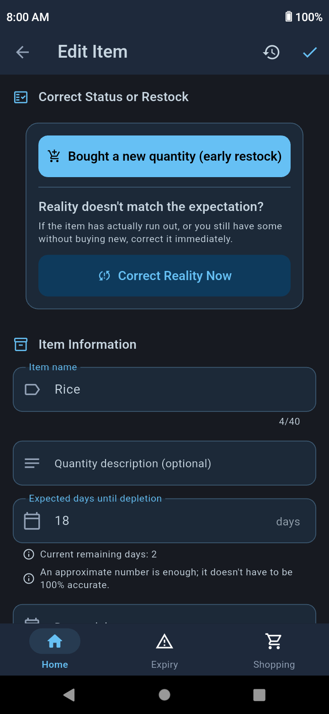

# Baly Groceries Tracker

[](LICENSE)
[](android/)
[](https://flutter.dev)
[](https://dart.dev)
[](https://riverpod.dev)
[](https://www.sqlite.org)


[](lib/l10n/)

A free, open-source app that frees your mind from constantly worrying about essential household needs.

At a quick glance, you can see how much you have left of eggs, flour, rice, and other daily essentials — so you always know what's about to run out and what's still in stock.

Stay organized and enjoy peace of mind by tracking your groceries and receiving alerts before essential items run out.

The app helps you prioritize what truly needs to be bought, making it easier to spend your budget on necessities first rather than on impulse purchases.

This reduces waste, lowers the risk of financial strain caused by poor planning, and gives you greater peace of mind in your daily life.

Perfect for families and anyone seeking a better, more organized life.

## Download

<div align="center">
  <div style="margin-bottom: 5px;">
    <a href="https://baly-groceries-tracker.en.uptodown.com/android"
       style="display: inline-block; text-decoration: none;">
      
    </a>
  </div>

  <div style="display: flex; justify-content: center; gap: 5px; flex-wrap: wrap;">
    <a href="https://f-droid.org/en/packages/com.baly_groceries_tracker.app/"
       style="display: inline-block; text-decoration: none;">
      
    </a>
    <a href="https://github.com/rw-account/baly_groceries_tracker/releases/latest"
       style="display: inline-block; text-decoration: none;">
      
    </a>
  </div>
</div>

## Key Features

### Expiry Screen

Displays all items that are about to run out, sorted by priority, with clear visual indicators — so you instantly know what needs to be bought first.

Frees you from constant worry and the recurring question: "Is something essential about to run out right now?"

### Smart Alerts

The app sends a notification when any household supply is close to running out, giving you enough time to plan your purchase before it runs out.

You can also manage notifications and disable them for any item as you wish, and choose your preferred time for notifications to arrive.

### Built-in Shopping List

No need to write your shopping list elsewhere. The app provides a shopping list where you can add items that are about to run out, along with anything else you don't track within the app.

So you buy only what you need and avoid unnecessary impulse purchases — with the option to easily share the list via WhatsApp with anyone who can do the shopping for you.

### Inventory Sharing

Want to let a family member know what's in the house?

No need to explain the state of your supplies manually. You can generate a summary showing all available items and how much is left of each, and easily share it via WhatsApp.

### Change History

Don't worry if you make a mistake updating an item's data or doubt a value you entered previously.

The app lets you review the change history to see what was modified and when, with the ability to easily revert to any previous state.

### Complete Privacy

All your data is stored locally on your device, and the app works fully offline, with the ability to create backups and restore them whenever needed.

### No Ads

The app is completely free of ads, so you can use it without any annoyance or distraction.

### Supports Arabic and English

The app supports both Arabic and English.

## Screenshots

<div align="center">
  <table>
    <tr>
      <td align="center"><b>Home Screen</b></td>
      <td align="center"><b>Expiry Screen</b></td>
    </tr>
    <tr>
      <td align="center">
        
      </td>
      <td align="center">
        
      </td>
    </tr>
    <tr>
      <td align="center"><b>Shopping List</b></td>
      <td align="center"><b>Edit Item</b></td>
    </tr>
    <tr>
      <td align="center">
        
      </td>
      <td align="center">
        
      </td>
    </tr>
    <tr>
      <td align="center"><b>Share Item Details</b></td>
      <td align="center"><b>Share Shopping List</b></td>
    </tr>
    <tr>
      <td align="center">
        
      </td>
      <td align="center">
        
      </td>
    </tr>
  </table>
</div>

## Building from Source

### Prerequisites

- **Flutter SDK:** `>= 3.44.8` (Stable Channel)

- **Dart SDK:** `>= 3.12.0`

- **Android SDK**

- **Java Development Kit (JDK):** `17` or later

- **Git**

---

### 1. Set Up the Project

Clone the repository and download the project dependencies:

```bash
git clone https://github.com/rw-account/baly_groceries_tracker.git
cd baly_groceries_tracker
flutter pub get
```

---

### 2. Choose a Build Method

Choose **one** of the following build methods based on your needs.

---

#### Standard Release Build

Suitable for building and testing the app in **Release** mode.

This method does not require any signing keys or secret configuration files. Simply run:

```bash
flutter build apk --release
```

**Output file:**

```text
build/app/outputs/flutter-apk/app-release.apk
```

---

#### Signed Release Build

Suitable for creating an official release signed with your own **Keystore (.jks)**, whether you plan to publish it on an app store or distribute it yourself.

1. Copy the signing configuration template:

```bash
cp android/key.properties.example android/key.properties
```

2. Open `android/key.properties`, then enter the path to your **Keystore (.jks)** file along with its passwords.

3. Build the app:

```bash
flutter build apk --release
```

**Output file:**

```text
build/app/outputs/flutter-apk/app-release.apk
```

---

## Contributing

Contributions are welcome! If you are looking for ideas or planned features to work on, feel free to check out [TODO.md](TODO.md).

To help keep the review process smooth, please keep pull requests focused and include a clear description of the changes.

### Before submitting a pull request

- Run `flutter analyze` and ensure it reports no errors or warnings.

- Regenerate localization and other generated files if you updated their source files:

  ```bash
  dart run build_runner build
  ```

- Keep each pull request focused on a single feature or fix. Avoid combining unrelated changes into the same pull request.

---

## License & Trademark

The source code of this project is licensed under the **MIT License**. For the full license text, see the [LICENSE](LICENSE) file.

The application name, logo, app icon, and other branding assets are **not** covered by the MIT License. Their use is governed by the [Trademark Policy](TRADEMARK.md).
