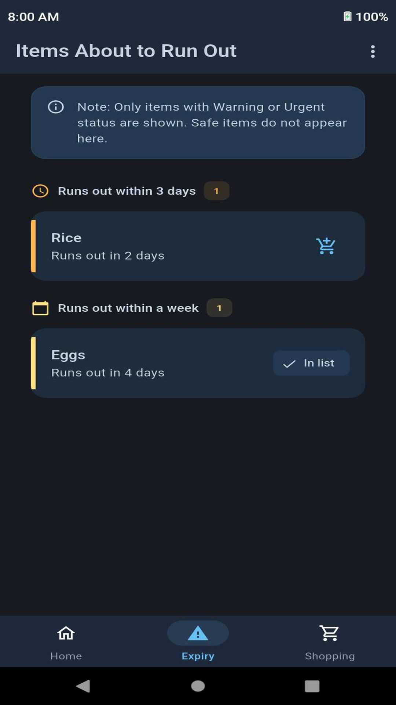
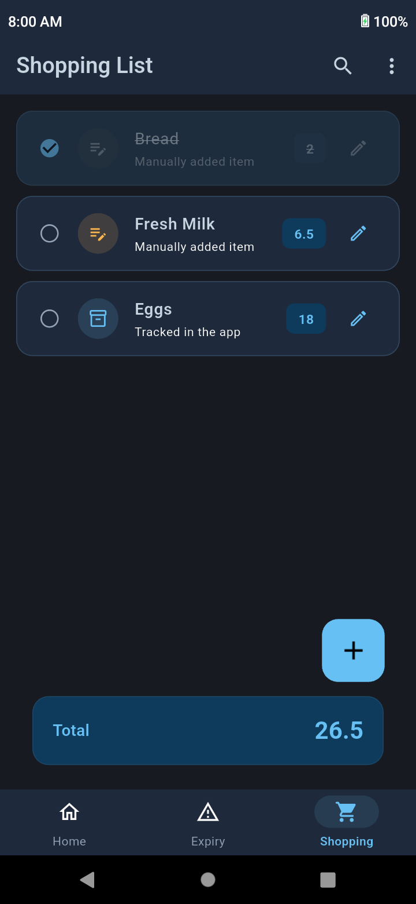
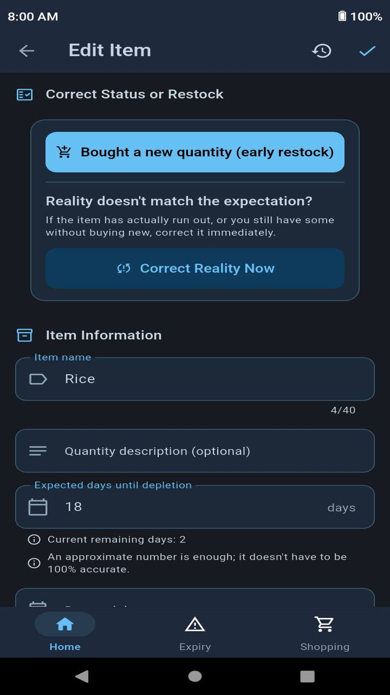
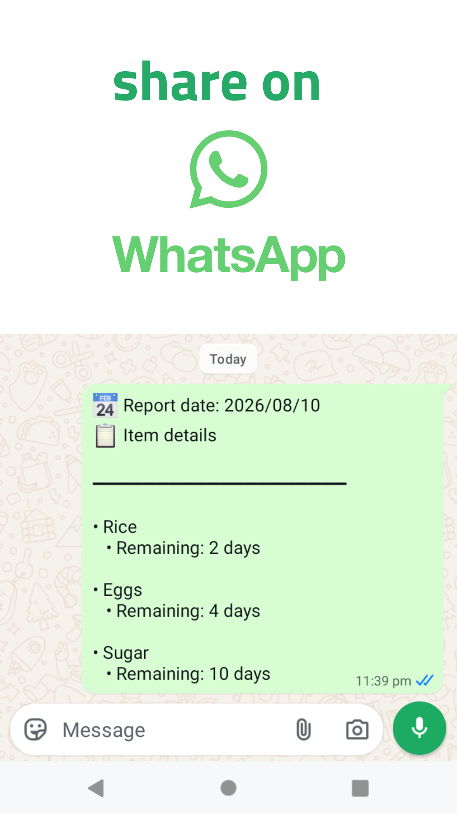
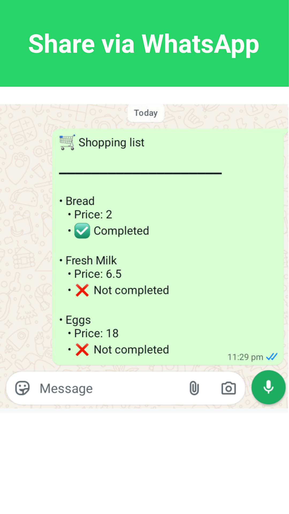

# Baly Groceries Tracker

[](LICENSE)
[](android/)
[](https://flutter.dev)
[](https://dart.dev)
[](https://riverpod.dev)
[](https://www.sqlite.org)


[](lib/l10n/)

**Baly Groceries Tracker** is a free and open-source app that gives you an instant overview of your groceries. See at a glance exactly how much you have left of eggs, flour, rice, and other everyday essentials, so you always know what's running low and what's still well stocked.

Stay organized and shop with confidence. By keeping track of your groceries and alerting you before essential items run low, the app helps you prioritize what truly needs to be replaced. This makes it easier to spend your budget on necessities first instead of impulse purchases, reducing waste, avoiding last-minute shortages, and giving you greater peace of mind in your day-to-day life, perfect for families and anyone seeking a better, more organized life.

## Key Features

### Expiry Screen

The **Expiry** screen automatically lists items that are running low, prioritized with clear visual indicators so you can instantly see what needs to be restocked first.

### Smart Notifications

Receive timely reminders before your groceries run low, giving you plenty of time to plan your shopping. You can also disable notifications for individual items whenever you like.

### Built-in Shopping List

No need for a separate shopping list app. Add items that are running low, along with anything else you need, and buy only what matters. Easily share your shopping list via WhatsApp with family or anyone shopping on your behalf.

### Share Your Inventory

Want to let a family member know what's available at home? Generate a summary of your tracked groceries, including the estimated time remaining for each item, and share it instantly via WhatsApp.

### Complete History

Made a mistake or want to check a previous update? Browse the complete history of every change, see exactly what was modified and when, and restore any previous version whenever you need.

### Private & Offline

Your data stays on your device and is never uploaded to external servers. The app works completely offline and lets you create and restore backups whenever needed.

### Ad-Free Experience

Enjoy a clean, distraction-free experience with no ads.

### Arabic & English Support

The app is fully available in both Arabic and English.

## Screenshots

<div align="center">
  <table>
    <tr>
      <td align="center"><b>Home Screen</b></td>
      <td align="center"><b>Expiry Screen</b></td>
    </tr>
    <tr>
      <td align="center">
        
      </td>
      <td align="center">
        
      </td>
    </tr>
    <tr>
      <td align="center"><b>Shopping List</b></td>
      <td align="center"><b>Edit Item</b></td>
    </tr>
    <tr>
      <td align="center">
        
      </td>
      <td align="center">
        
      </td>
    </tr>
    <tr>
      <td align="center"><b>Share Item Details</b></td>
      <td align="center"><b>Share Shopping List</b></td>
    </tr>
    <tr>
      <td align="center">
        
      </td>
      <td align="center">
        
      </td>
    </tr>
  </table>
</div>

## Building from Source

### Prerequisites

- **Flutter SDK:** `>= 3.44.8` (Stable Channel)

- **Dart SDK:** `>= 3.12.0`

- **Android SDK**

- **Java Development Kit (JDK):** `17` or later

- **Git**

---

### 1. Set Up the Project

Clone the repository and download the project dependencies:

```bash
git clone https://github.com/rw-account/baly_groceries_tracker.git
cd baly_groceries_tracker
flutter pub get
```

---

### 2. Choose a Build Method

Choose **one** of the following build methods based on your needs.

---

#### Standard Release Build

Suitable for building and testing the app in **Release** mode.

This method does not require any signing keys or secret configuration files. Simply run:

```bash
flutter build apk --release
```

**Output file:**

```text
build/app/outputs/flutter-apk/app-release.apk
```

---

#### Signed Release Build

Suitable for creating an official release signed with your own **Keystore (.jks)**, whether you plan to publish it on an app store or distribute it yourself.

1. Copy the signing configuration template:

```bash
cp android/key.properties.example android/key.properties
```

2. Open `android/key.properties`, then enter the path to your **Keystore (.jks)** file along with its passwords.

3. Build the app:

```bash
flutter build apk --release
```

**Output file:**

```text
build/app/outputs/flutter-apk/app-release.apk
```

---

## Contributing

Contributions are welcome! If you are looking for ideas or planned features to work on, feel free to check out [TODO.md](TODO.md).

To help keep the review process smooth, please keep pull requests focused and include a clear description of the changes.

### Before submitting a pull request

- Run `flutter analyze` and ensure it reports no errors or warnings.

- Regenerate localization and other generated files if you updated their source files:

  ```bash
  dart run build_runner build
  ```

- Keep each pull request focused on a single feature or fix. Avoid combining unrelated changes into the same pull request.

---

## License & Trademark

The source code of this project is licensed under the **MIT License**. For the full license text, see the [LICENSE](LICENSE) file.

The application name, logo, app icon, and other branding assets are **not** covered by the MIT License. Their use is governed by the [Trademark Policy](TRADEMARK.md).
