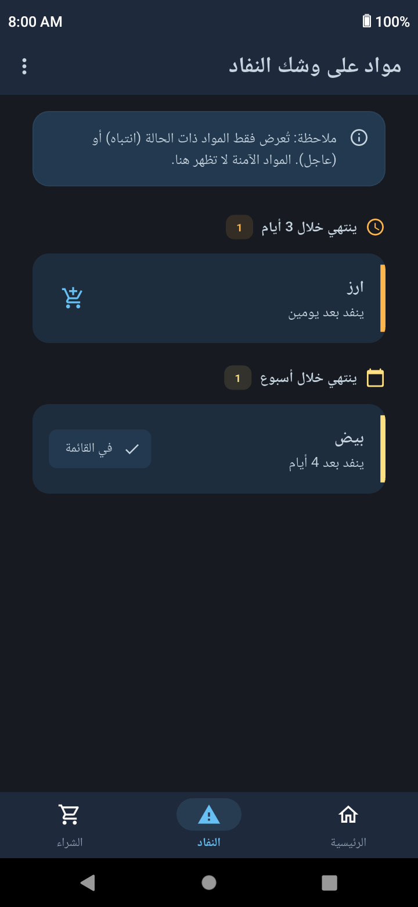
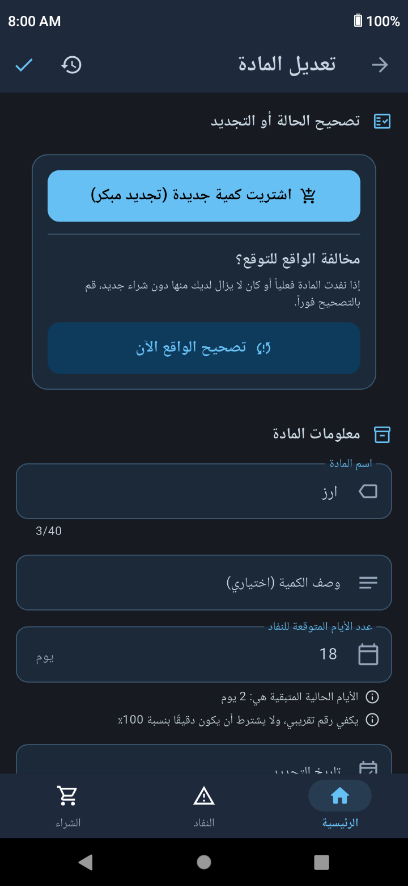
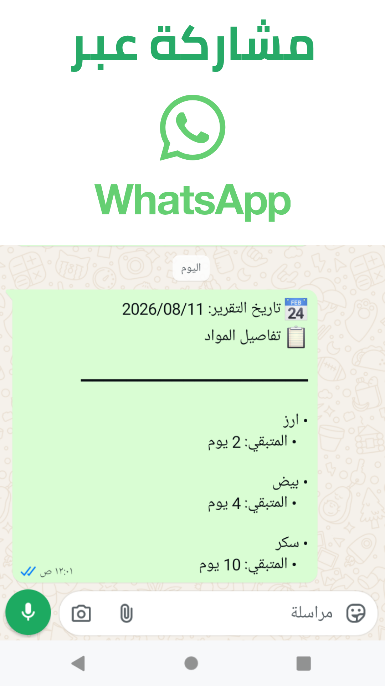
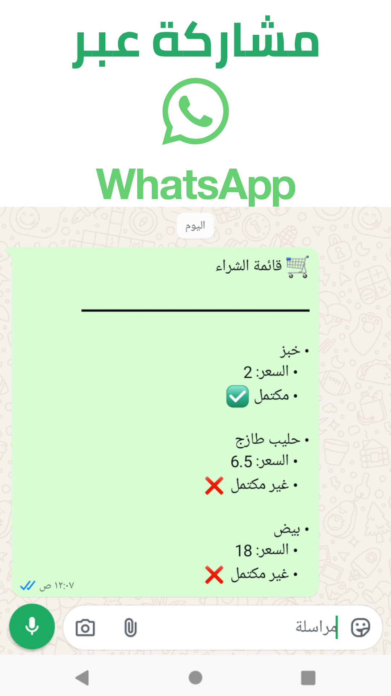

# Baly Groceries Tracker
 

تطبيق مجاني ومفتوح المصدر يريح عقلك من التفكير المستمر بشأن متطلبات المنزل الأساسية.

في لمحة سريعة، تعرف الكمية المتبقية لديك من البيض والدقيق والأرز وغيرها من الضروريات اليومية، حتى تعرف دائمًا ما هو على وشك النفاد وما يزال متوفرًا.

حافظ على التنظيم وراحة البال من خلال تتبع مشترياتك الغذائية، والحصول على تنبيهات قبل نفاد العناصر الأساسية.

يساعدك التطبيق على تحديد أولويات ما يحتاج فعلًا إلى الشراء، مما يجعل من الأسهل إنفاق ميزانيتك على الضروريات أولًا بدلًا من المشتريات العشوائية.

وبذلك يقلل الهدر، ويقلل فرصة الوقوع في أزمات مالية ناتجة عن سوء التخطيط، ويمنحك راحة بال أكبر في حياتك اليومية.

مثالي للعائلات ولكل من يسعى لحياة أفضل وأكثر تنظيمًا.

## التحميل

  

   

  

  

## الميزات الرئيسية

### شاشة "النفاد"

تعرض جميع المواد التي أوشكت على النفاد، مرتبة حسب الأولوية، مع مؤشرات بصرية واضحة، لتعرف فورًا ما يجب شراؤه أولًا.

تخلصك من القلق المستمر والتساؤل: "هل سينتهي شيء من احتياجات البيت الضرورية الآن؟"

### تنبيهات ذكية

يرسل التطبيق إشعارًا عند اقتراب نفاد أي من احتياجات المنزل، مما يمنحك الوقت الكافي للتخطيط لشرائها قبل نفادها.

كما يمكنك التحكم في الإشعارات وتعطيلها لأي عنصر حسب رغبتك، واختيار الموعد الذي تفضله لوصول الإشعارات.

### قائمة تسوق مدمجة

لا داعي لكتابة قائمة مشترياتك في مكان آخر. يوفّر التطبيق قائمة شراء تتيح لك إضافة المواد التي أوشكت على النفاد، بالإضافة إلى أي أشياء أخرى لا تتابعها داخل التطبيق.

لتشتري ما تحتاجه فقط، وتتجنب المشتريات العشوائية غير الضرورية، مع إمكانية مشاركتها بسهولة عبر واتساب مع أي شخص ليقوم بشرائها.

### مشاركة المخزون

هل تريد إخبار أحد أفراد العائلة بما هو موجود في البيت؟

لا حاجة لشرح حالة المستلزمات يدويًا. يمكنك إنشاء ملخص يوضح جميع العناصر الموجودة والمدة المتبقية لكل منها، ومشاركته بسهولة عبر واتساب.

### سجل التغييرات

لا تقلق إذا أخطأت في تعديل بيانات أحد العناصر أو شككت في قيمة أدخلتها سابقًا.

يتيح لك التطبيق مراجعة سجل التغييرات لمعرفة ما تم تعديله ومتى حدث ذلك، مع إمكانية الرجوع إلى أي حالة سابقة بسهولة.

### خصوصية كاملة

تُحفظ جميع بياناتك محليًا على جهازك، ويعمل التطبيق بالكامل دون اتصال بالإنترنت، مع إمكانية إنشاء نسخ احتياطية واستعادتها عند الحاجة.

### بدون إعلانات

يخلو التطبيق تمامًا من الإعلانات، لتستخدمه دون أي إزعاج أو تشتيت.

### يدعم العربية والإنجليزية

يدعم التطبيق اللغتين العربية والإنجليزية.

## لقطات الشاشة

 

  <table>
    <tr>
      <td align="center"><b>الرئيسية</b></td>
      <td align="center"><b>شاشة النفاد</b></td>
    </tr>
    <tr>
      <td align="center">
        
      </td>
      <td align="center">
        
      </td>
    </tr>
    <tr>
      <td align="center"><b>قائمة الشراء</b></td>
      <td align="center"><b>تعديل المادة</b></td>
    </tr>
    <tr>
      <td align="center">
        
      </td>
      <td align="center">
        
      </td>
    </tr>
    <tr>
      <td align="center"><b>مشاركة تفاصيل المواد</b></td>
      <td align="center"><b>مشاركة قائمة الشراء</b></td>
    </tr>
    <tr>
      <td align="center">
        
      </td>
      <td align="center">
        
      </td>
    </tr>
  </table>

## روابط إضافية

<ul dir="rtl">

 

<li>

[خطوات البناء وتجميع التطبيق من المصدر (Building from Source)](README.md#building-from-source)
</li>

 

<li>

[دليل المساهمة في المشروع (Contributing)](README.md#contributing)
</li>

 

<li>

[الرخصة والعلامة التجارية (License & Trademark)](README.md#license--trademark)
</li>

</ul>

