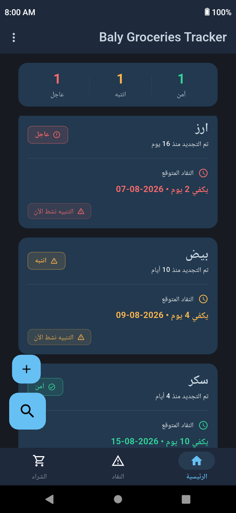
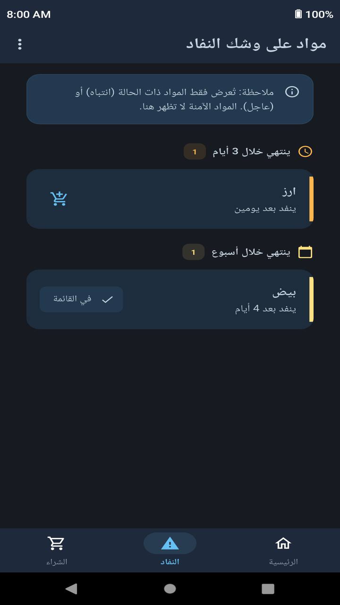
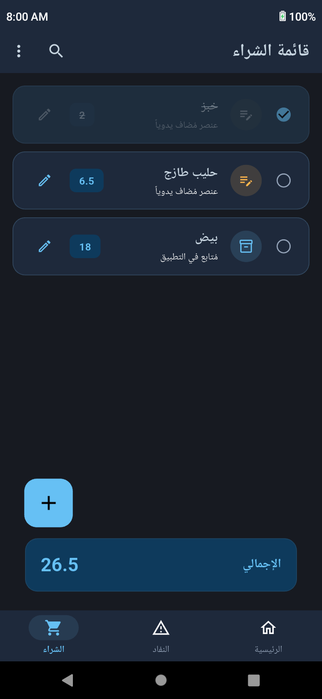
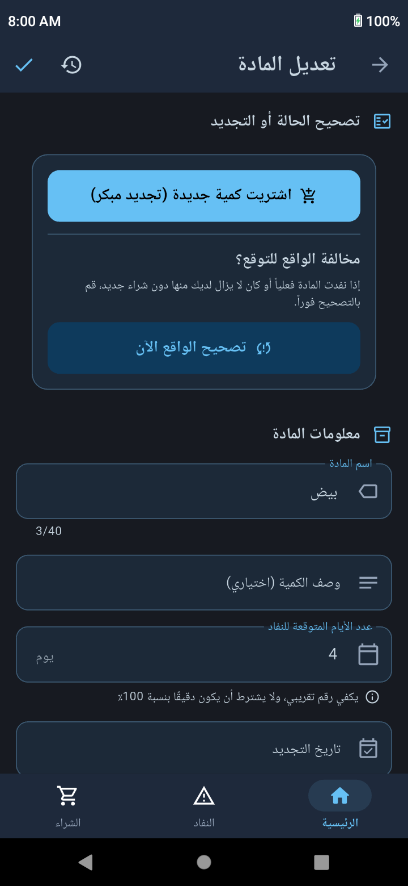

# متابعة طلبات البيت
 

**متابعة طلبات البيت** هو تطبيق يتيح لك معرفة الكمية المتبقية من البيض والدقيق والأرز وغيرها من المستلزمات، بمجرد إلقاء نظرة واحدة على التطبيق، لتعرف فورًا ما أوشك على النفاد وما زال متوفرًا.

يساعدك ذلك على ترتيب أولويات الشراء، مما يمنحك تحكمًا أكبر في مصروفات المنزل. إذ ينبهك التطبيق مسبقًا إلى المستلزمات التي أوشكت على النفاد، لتتمكن من تخصيص جزء من ميزانيتك لشرائها قبل إنفاقها بشكل لا واعي على الكماليات، كما يخفف من القلق بشأن نفاد مستلزمات المنزل الضرورية، ويمنحك راحة البال بفضل معرفتك الدائمة بما هو متوفر لديك. كما يوفر التطبيق العديد من المميزات، من أبرزها:

<ul dir="rtl">
 

<li>
تعرض شاشة <strong>"النفاد"</strong> جميع المستلزمات القريبة من النفاد مرتبة حسب الأولوية، مع تصنيف بصري واضح يساعدك على معرفة ما يحتاج إلى الشراء أولًا.
</li>

 

<li>
يرسل التطبيق إشعارًا عند اقتراب نفاد مستلزمات المنزل، مما يمنحك الوقت الكافي للتخطيط لشرائها قبل نفادها، مع إمكانية تعطيل الإشعارات لأي عنصر حسب رغبتك.
</li>

 

<li>
لا داعي لكتابة قائمة مشترياتك في مكان آخر. يوفّر التطبيق قائمة شراء تتيح لك إضافة المستلزمات التي أوشكت على النفاد، بالإضافة إلى أي أشياء أخرى لا تتابعها داخل التطبيق، لتشتري ما تحتاجه فقط وتتجنب المشتريات العشوائية غير الضرورية، مع إمكانية مشاركتها بسهولة عبر واتساب مع أي شخص ليقوم بشرائها.
</li>

 

<li>
هل تريد إخبار أحد أفراد العائلة بما هو موجود في البيت؟ يمكنك إنشاء ملخص يوضح المستلزمات الموجودة والمدة المتبقية لكل منها، ومشاركته بسهولة عبر واتساب.
</li>

 

<li>
لا تقلق إذا أخطأت في تعديل بيانات أحد العناصر أو شككت في قيمة أدخلتها سابقًا. يتيح لك التطبيق مراجعة سجل التغييرات لمعرفة ما تم تعديله ومتى حدث ذلك، مع إمكانية الرجوع إلى أي حالة سابقة بسهولة.
</li>

 

<li>
تُحفظ بياناتك محليًا على جهازك حفاظًا على خصوصيتك، ويعمل التطبيق بالكامل دون الحاجة إلى اتصال بالإنترنت، مع إمكانية إنشاء نسخ احتياطية من بياناتك واستعادتها عند الحاجة.
</li>

 

<li>
يخلو التطبيق تمامًا من الإعلانات، لتستخدمه دون أي إزعاج أو تشتيت.
</li>

 

<li>
يدعم التطبيق اللغتين العربية والإنجليزية.
</li>

</ul>

## لقطات الشاشة

 

  <table>
    <tr>
      <td align="center"><b>الرئيسية</b></td>
      <td align="center"><b>شاشة النفاد</b></td>
    </tr>
    <tr>
      <td align="center">
        
      </td>
      <td align="center">
        
      </td>
    </tr>
    <tr>
      <td align="center"><b>قائمة الشراء</b></td>
      <td align="center"><b>تعديل المادة</b></td>
    </tr>
    <tr>
      <td align="center">
        
      </td>
      <td align="center">
        
      </td>
    </tr>
  </table>

## روابط إضافية

<ul dir="rtl">

 

<li>

[خطوات البناء وتجميع التطبيق من المصدر (Building from Source)](README.md#building-from-source)
</li>

 

<li>

[دليل المساهمة في المشروع (Contributing)](README.md#contributing)
</li>

 

<li>

[الرخصة والعلامة التجارية (License & Trademark)](README.md#license--trademark)
</li>

</ul>

